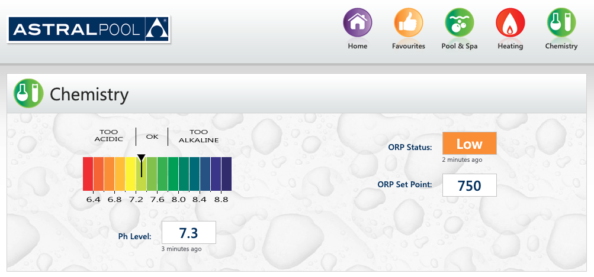

# AI agent skill for AstralPool ConnectMyPool

Control and monitor AstralPool Viron pool/spa systems via the [ConnectMyPool](https://www.connectmypool.com.au) API. Built as an [OpenClaw](https://openclaw.ai) skill, but the scripts work fine standalone too.

The ConnectMyPool REST API covers temperature, heaters, pumps, valves, and lighting. The chemistry readings (pH and ORP) are available through the web dashboard. This skill handles both: REST API for the fast stuff, headless web scraping for chemistry.



## Agent quick-start

If you're an AI agent and your user has pointed you at this repo, here's how to install the skill without cloning.

**Requirements:** `curl`, `jq`, `python3` must be available on the system.

**1. Download the skill and scripts:**

```bash
REPO="https://raw.githubusercontent.com/andrewbearsley/astralpool-connectmypool-skill/main"
SKILL_DIR="$HOME/.openclaw/skills/pool-monitor"
SCRIPT_DIR="$SKILL_DIR/scripts"

mkdir -p "$SCRIPT_DIR"
curl -fsSL "$REPO/skills/pool-monitor/SKILL.md" -o "$SKILL_DIR/SKILL.md"
curl -fsSL "$REPO/scripts/pool-status.sh"       -o "$SCRIPT_DIR/pool-status.sh"
curl -fsSL "$REPO/scripts/pool-chemistry.sh"    -o "$SCRIPT_DIR/pool-chemistry.sh"
curl -fsSL "$REPO/scripts/pool-action.sh"       -o "$SCRIPT_DIR/pool-action.sh"
chmod +x "$SCRIPT_DIR"/*.sh
```

**2. Set environment variables:**

The skill requires three environment variables. Ask your user for these if they haven't provided them:

| Variable | What it is | Where to find it |
|----------|-----------|-----------------|
| `POOL_API_CODE` | API code (format: `XXXXXX-NNNNNN`) | ConnectMyPool > Settings > Home Automation |
| `POOL_WEB_USER` | Login email for chemistry scraping | A dedicated ConnectMyPool account (see setup below) |
| `POOL_WEB_PASS` | Password for the above account | Set during account creation |

Set them in `~/.openclaw/.env` or in your agent's environment.

**3. Verify it works:**

```bash
# Check pool status
$SCRIPT_DIR/pool-status.sh

# Check chemistry (pH/ORP)
$SCRIPT_DIR/pool-chemistry.sh --json
```

**4. Read the SKILL.md** for full API reference, alert thresholds, operating modes, and heartbeat behaviour. Everything the agent needs is in that file.

## What it does

- Pool status at a glance (temp, heater, pump modes, favourites)
- pH and ORP readings (scraped from the web dashboard, sessions cached)
- Control commands: `pool-heat`, `spa-heat`, `pool-filter`, `spa-filter`, `all-off`
- Heartbeat monitoring that only alerts when something's wrong
- Configurable thresholds for alerts (spa hours, temp ranges, chemistry)

## Human setup

These steps need to be done by a human before the agent can use the skill.

### 1. Get your API code

1. Log in to [ConnectMyPool](https://www.connectmypool.com.au) on a desktop browser
2. **Settings > Home Automation**
3. If you haven't already, click **Request Home Automation Access** -- AstralPool needs to approve it
4. Once approved, you'll see your **Pool API Code** (format: `XXXXXX-NNNNNN`)

### 2. Create a web login for chemistry scraping

The REST API doesn't expose pH/ORP at all. To get chemistry readings, the skill scrapes the web dashboard. Create a separate account for this rather than using your main one.

1. From your primary account, go to **Settings > User List > Add User**
2. The new user will receive a verification email -- **they must click the link** or the skill will fail silently
3. Once verified, go to **Screen Configuration** for that user and **Allow all actions for all sections**
4. Log in as the new account and confirm you can see the Chemistry page

### 3. Give your agent the credentials

Either set the three environment variables (`POOL_API_CODE`, `POOL_WEB_USER`, `POOL_WEB_PASS`) in your agent's environment, or add them to `~/.openclaw/.env`:

```
POOL_API_CODE=XXXXXX-NNNNNN
POOL_WEB_USER=your_automation_email@example.com
POOL_WEB_PASS=your_password
```

Then point your agent at this repo and ask it to install the skill.

## Usage

### Status

```bash
./scripts/pool-status.sh              # Formatted summary with equipment names
./scripts/pool-status.sh --raw        # Raw JSON from the API
```

### Chemistry

```bash
./scripts/pool-chemistry.sh           # Formatted, with warnings
./scripts/pool-chemistry.sh --json    # JSON for programmatic use
```

Sessions are cached at `~/.pool-session-cookies` so it doesn't log in every time. If the session expires, it re-authenticates automatically.

### Control

```bash
./scripts/pool-action.sh pool-filter  # Normal daily mode (pool, heater off)
./scripts/pool-action.sh pool-heat    # Heat the pool (targets pool set temp)
./scripts/pool-action.sh spa-heat     # Spa session (targets spa set temp, ~40C)
./scripts/pool-action.sh spa-filter   # Circulate spa water without heating
./scripts/pool-action.sh all-off      # Everything off
```

All commands prompt before executing. Pass `--yes` to skip (useful for automation).

### Heartbeat

If your agent supports heartbeat checks:

```markdown
- [ ] Check pool status and chemistry via the pool-monitor skill. Alert me if:
      the pool is offline, filter pump is off, spa is running outside 7pm-12am,
      temp is outside 15-35C, pH is outside 7.2-7.6, or ORP is low.
      Don't message me if everything looks fine.
```

## What it alerts on

| Condition | Severity |
|-----------|----------|
| Pool controller offline | High |
| Filter pump off (usually means low water level) | High |
| Spa running outside configured hours | High |
| Temp below 5C or above 40C (sensor fault) | High |
| pH outside 7.0-7.8 | High |
| ORP low (< 650 mV) | High |
| Temp outside 15-35C | Medium |
| ORP high (> 800 mV) | Medium |
| Heater on but water already past set temp | Medium |
| pH slightly off (outside 7.2-7.6 but within safe range) | Low |

All thresholds are configurable in `SKILL.md`. The skill stays quiet when everything's normal.

## Troubleshooting

| Problem | What's going on | Fix |
|---------|-----------------|-----|
| "Invalid API Code" | Wrong code, or API access not enabled | Check ConnectMyPool > Settings > Home Automation |
| Chemistry login fails with no error | Email not verified | Check your inbox for the verification link |
| "Pool Not Connected" | Gateway is offline | Check the Astral Internet Gateway has power and network |
| "Time Throttle Exceeded" | Too many API calls | Wait 60s between requests |
| Chemistry page loads but no data | Controller offline or no chemistry module | Check `pool-status.sh` first |

## Rate limits

The ConnectMyPool API is throttled to one request per endpoint per 60 seconds. After sending a control action, the throttle lifts for 5 minutes (so you can check the result). The web dashboard has similar limits.

## Files

| File | Purpose |
|------|---------|
| `skills/pool-monitor/SKILL.md` | Skill definition -- full API reference, alert thresholds, agent instructions |
| `scripts/pool-status.sh` | Pool status via REST API |
| `scripts/pool-chemistry.sh` | pH/ORP via web scraping |
| `scripts/pool-action.sh` | Control commands |
| `HEARTBEAT.md` | Example heartbeat config |

## License

MIT
